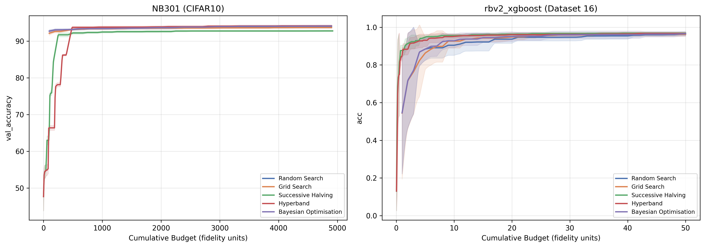
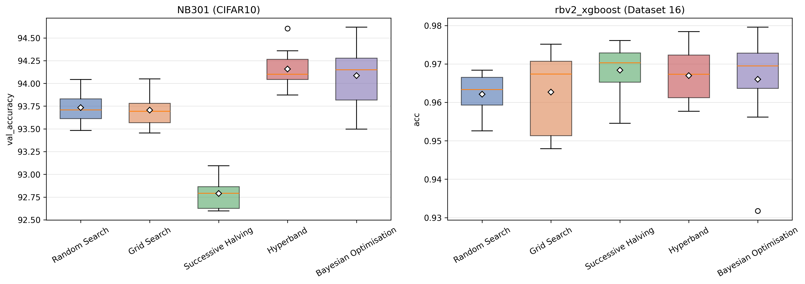

# Hyperparameter Optimisation (HPO) Lab

This repository contains the complete implementation and experimental evaluation for the **Hyperparameter Optimisation for Machine Learning** assignment (RWTH Aachen University). The goal of this project is to implement, evaluate, and compare five distinct hyperparameter optimisation algorithms on two robust, multi-fidelity YAHPO Gym benchmarks.

## 🚀 Implemented Algorithms

A core constraint of this assignment was implementing these algorithms strictly using Python, `numpy`, and `scikit-learn` (specifically prohibiting `scipy`  for statistical distributions and acquisition function optimization).

1. **Random Search**: A baseline that samples hyperparameter configurations uniformly at random to explore the space.
2. **Grid Search**: Evaluates points on a manually constructed grid. It relies on a fallback mechanism for massive categorical architectures (>10,000 configurations like in NB301).
3. **Successive Halving (SH)**: A multi-fidelity approach that evaluates many configurations on a low budget, aggressively discarding the bottom performers and promoting the top fraction ($\eta = 3$) to higher budgets.
4. **Hyperband (HB)**: Extends Successive Halving by running a portfolio of SH brackets with varying exploration-exploitation trade-offs to neutralize SH's sensitivity to initial budget allocation.
5. **Bayesian Optimisation (BO)**: Fits a Gaussian Process (GP) surrogate with a Matérn-5/2 kernel to past observations. It determines the next configuration to evaluate by maximizing Expected Improvement (EI). **Note:** Both the Normal CDF/PDF operations and the EI acquisition function were implemented strictly from scratch using `numpy.math.erf` to bypass the `scipy` dependency restriction.

## 🧪 Benchmarks

We evaluated the algorithms on two tasks from the **YAHPO Gym** framework, receiving a fixed budget of 50 full evaluations ($50 \times r_{max}$):

1. **NB301 (CIFAR-10)**: A high-dimensional, highly conditional neural architecture search space ($r_{max} = 98$ epochs).
2. **rbv2_xgboost (Dataset 16)**: Tuning an XGBoost model where the fidelity dimension represents the fraction of the training set used.

## 📊 Results & Insights

All experiments were run across **10 independent seeds**. The summarized results indicate the mean final performance ± the standard deviation.

| Algorithm | NB301 (val_accuracy) | rbv2_xgboost (accuracy) |
|---|---|---|
| **Random Search** | 93.73 ± 0.17 % | 0.962 ± 0.005 |
| **Grid Search** | 93.71 ± 0.18 % | 0.963 ± 0.010 |
| **Successive Halving** | 92.79 ± 0.17 % | **0.968 ± 0.007** |
| **Hyperband** | **94.16 ± 0.20 %** | 0.967 ± 0.007 |
| **Bayesian Opt.** | 94.08 ± 0.32 % | 0.966 ± 0.013 |

### Incumbent Curves

### Final Performance Distributions

### Key Takeaways
* **Hyperband dominates NB301**: For highly conditional architectural spaces where early-fidelity metrics might be noisy, having a portfolio of brackets (Hyperband) vastly outperforms a single low-budget, high-exploration bracket (Successive Halving).
* **Multi-Fidelity Efficiency**: On the smooth, well-conditioned `rbv2_xgboost` space, multi-fidelity methods (SH and HB) find near-optimal candidates in under 10 full-budget equivalents, effectively crushing Random Search and Grid Search early on.
* **Curse of Dimensionality in BO**: Bayesian Optimisation struggles slightly with variance on NB301. The one-hot encoding expands the categorical space to 234 dimensions, making it exceptionally difficult for a standard Matérn GP to model the surface accurately within just 50 evaluations.

## 📁 Repository Structure
* `utils.py`: Manual Configuration Space sampling, encoding, and grid building logic.
* `{algorithm}.py`: Core implementation of each optimizer.
* `experiment.py`: Main YAHPO Gym integration, config-loop runner, and checkpointing logic.
* `plot_results.py`: Data aggregation and matplotlib visualization scripts.
* `report/, figures/, results/`: Compiled experimental outputs, plots, and the academic 2-page LaTeX report.
